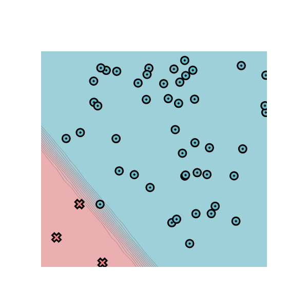
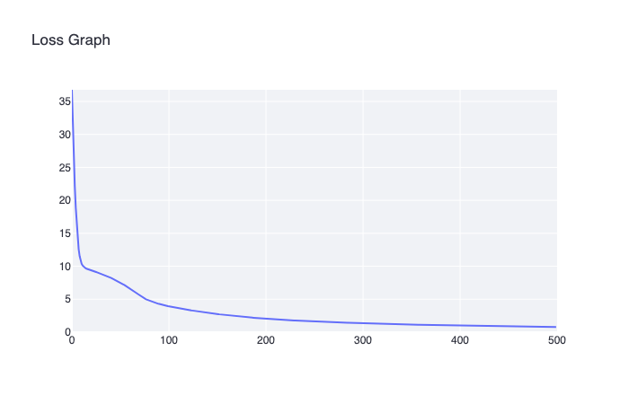
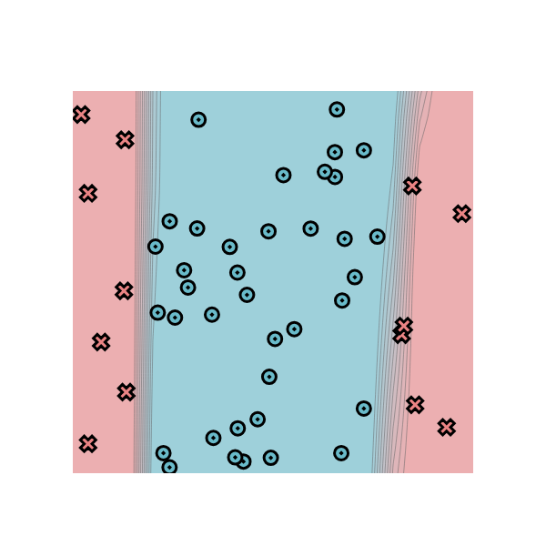
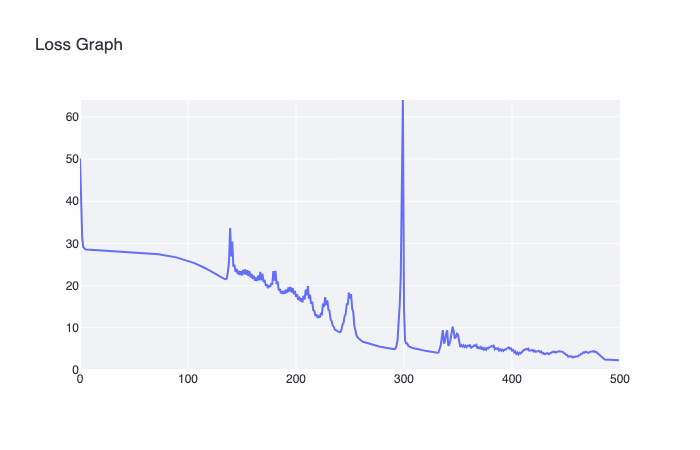
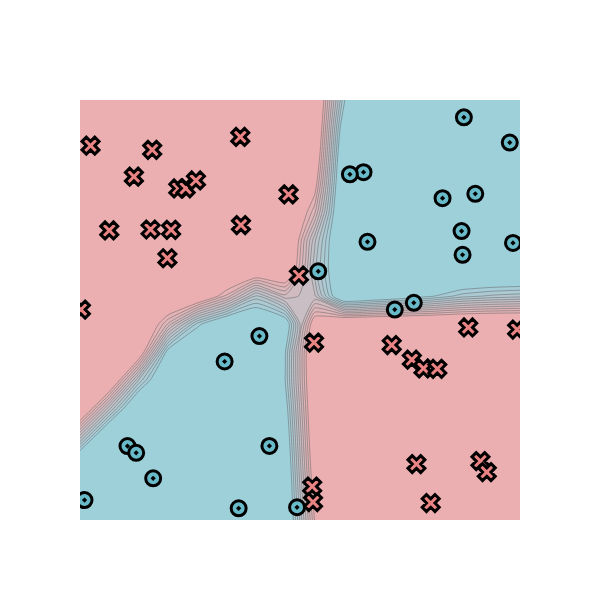
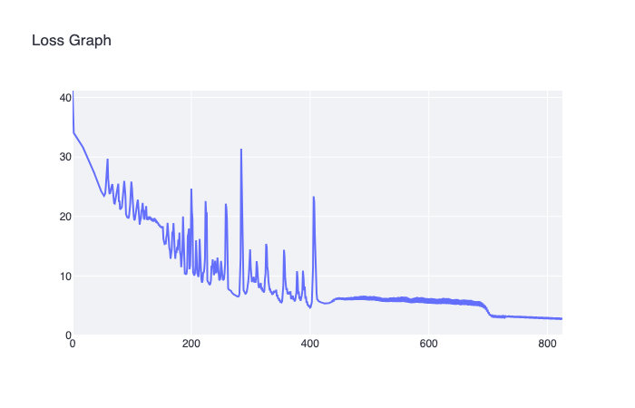

[](https://classroom.github.com/a/YFgwt0yY)
# MiniTorch Module 2


* Docs: https://minitorch.github.io/

* Overview: https://minitorch.github.io/module2/module2/

This assignment requires the following files from the previous assignments. You can get these by running

```bash
python sync_previous_module.py previous-module-dir current-module-dir
```

The files that will be synced are:

        minitorch/operators.py minitorch/module.py minitorch/autodiff.py minitorch/scalar.py minitorch/scalar_functions.py minitorch/module.py project/run_manual.py project/run_scalar.py project/datasets.py


## Module 2.5

### Simple Plot

Hidden Layers: 2

Learning Rate: 0.1

Number of Epochs: 500

Time per Epoch: 0.186s

Total Time: 93 seconds


| Epoch |  Loss   | Correct |
|-------|---------|---------|
| 500   | 1.9765  | 50      |
| 490   | 2.0127  | 50      |
| 480   | 2.0503  | 50      |
| 470   | 2.0896  | 50      |
| 460   | 2.1306  | 50      |
| 450   | 2.1735  | 50      |
| 440   | 2.2183  | 50      |
| 430   | 2.2654  | 50      |
| 420   | 2.3147  | 50      |
| 410   | 2.3666  | 50      |
| 400   | 2.4212  | 50      |
| 390   | 2.4787  | 50      |
| 380   | 2.5394  | 50      |
| 370   | 2.6036  | 50      |
| 360   | 2.6717  | 50      |
| 350   | 2.7442  | 50      |
| 340   | 2.8216  | 50      |
| 330   | 2.9043  | 50      |
| 320   | 2.9931  | 50      |
| 310   | 3.0885  | 50      |
| 300   | 3.1911  | 50      |
| 290   | 3.3022  | 50      |
| 280   | 3.4226  | 50      |
| 270   | 3.5538  | 50      |
| 260   | 3.6980  | 50      |
| 250   | 3.8574  | 49      |
| 240   | 4.0350  | 49      |
| 230   | 4.2333  | 49      |
| 220   | 4.4564  | 49      |
| 210   | 4.7095  | 49      |
| 200   | 5.0001  | 49      |
| 190   | 5.3367  | 49      |
| 180   | 5.7304  | 49      |
| 170   | 6.1990  | 49      |
| 160   | 6.7645  | 48      |
| 150   | 7.4502  | 48      |
| 140   | 8.3125  | 48      |
| 130   | 9.3211  | 48      |
| 120   | 10.5069 | 48      |
| 110   | 11.9757 | 48      |
| 100   | 13.8132 | 47      |
| 90    | 15.8962 | 46      |
| 80    | 18.2282 | 46      |
| 70    | 20.7594 | 44      |
| 60    | 23.2151 | 43      |
| 50    | 25.6171 | 42      |
| 40    | 27.7519 | 40      |
| 30    | 29.3709 | 36      |
| 20    | 30.7235 | 34      |
| 10    | 32.3415 | 28      |


### Diagonal Plot

Hidden Layers: 2

Learning Rate: 0.5

Number of Epochs: 500

Time per Epoch: 0.044s

Total Time: 22 seconds




| Step | Epoch | Loss   | Correct |
|------|-------|--------|---------|
| 0    | 500   | 0.7893 | 50      |
| 1    | 490   | 0.8082 | 50      |
| 2    | 480   | 0.8277 | 50      |
| 3    | 470   | 0.8478 | 50      |
| 4    | 460   | 0.8686 | 50      |
| 5    | 450   | 0.8902 | 50      |
| 6    | 440   | 0.9126 | 50      |
| 7    | 430   | 0.9358 | 50      |
| 8    | 420   | 0.9599 | 50      |
| 9    | 410   | 0.9850 | 50      |
| 10   | 400   | 1.0111 | 50      |
| 11   | 390   | 1.0384 | 50      |
| 12   | 380   | 1.0670 | 50      |
| 13   | 370   | 1.0969 | 50      |
| 14   | 360   | 1.1283 | 50      |
| 15   | 350   | 1.1614 | 50      |
| 16   | 340   | 1.1962 | 50      |
| 17   | 330   | 1.2331 | 50      |
| 18   | 320   | 1.2722 | 50      |
| 19   | 310   | 1.3137 | 50      |
| 20   | 300   | 1.3580 | 50      |
| 21   | 290   | 1.4054 | 50      |
| 22   | 280   | 1.4562 | 50      |
| 23   | 270   | 1.5109 | 50      |
| 24   | 260   | 1.5700 | 50      |
| 25   | 250   | 1.6340 | 50      |
| 26   | 240   | 1.7037 | 50      |
| 27   | 230   | 1.7803 | 50      |
| 28   | 220   | 1.8632 | 50      |
| 29   | 210   | 1.9550 | 50      |
| 30   | 200   | 2.0563 | 49      |
| 31   | 190   | 2.1685 | 49      |
| 32   | 180   | 2.2934 | 49      |
| 33   | 170   | 2.4321 | 49      |
| 34   | 160   | 2.5875 | 49      |
| 35   | 150   | 2.7604 | 49      |
| 36   | 140   | 2.9527 | 49      |
| 37   | 130   | 3.1676 | 49      |
| 38   | 120   | 3.4064 | 47      |
| 39   | 110   | 3.6690 | 47      |
| 40   | 100   | 3.9593 | 47      |
| 41   | 90    | 4.3092 | 47      |
| 42   | 80    | 4.8300 | 47      |
| 43   | 70    | 5.6777 | 47      |
| 44   | 60    | 6.7013 | 47      |
| 45   | 50    | 7.5842 | 47      |
| 46   | 40    | 8.3155 | 47      |
| 47   | 30    | 8.9181 | 47      |
| 48   | 20    | 9.4237 | 47      |
| 49   | 10    | 10.8317| 47      |


### Split Plot

Hidden Layers: 4

Learning Rate: 0.5

Number of Epochs: 500

Time per Epoch: 0.089s

Total Time: 44.5 seconds




| Step | Epoch | Loss    | Correct |
|------|-------|---------|---------|
| 0    | 500   | 2.3089  | 50      |
| 1    | 490   | 2.4790  | 50      |
| 2    | 480   | 4.0210  | 47      |
| 3    | 470   | 4.2472  | 47      |
| 4    | 460   | 3.1812  | 48      |
| 5    | 450   | 3.9125  | 47      |
| 6    | 440   | 4.3703  | 47      |
| 7    | 430   | 4.0391  | 47      |
| 8    | 420   | 4.7762  | 47      |
| 9    | 410   | 4.2854  | 47      |
| 10   | 400   | 5.1476  | 47      |
| 11   | 390   | 4.9189  | 47      |
| 12   | 380   | 5.4050  | 47      |
| 13   | 370   | 5.4010  | 47      |
| 14   | 360   | 5.7707  | 47      |
| 15   | 350   | 8.5909  | 46      |
| 16   | 340   | 8.5431  | 46      |
| 17   | 330   | 4.0912  | 50      |
| 18   | 320   | 4.5949  | 49      |
| 19   | 310   | 5.1396  | 49      |
| 20   | 300   | 63.9986 | 39      |
| 21   | 290   | 4.9593  | 50      |
| 22   | 280   | 5.4563  | 49      |
| 23   | 270   | 6.1411  | 48      |
| 24   | 260   | 7.1658  | 47      |
| 25   | 250   | 18.3375 | 40      |
| 26   | 240   | 9.0981  | 46      |
| 27   | 230   | 16.4959 | 40      |
| 28   | 220   | 13.1726 | 41      |
| 29   | 210   | 19.0573 | 39      |
| 30   | 200   | 18.7309 | 39      |
| 31   | 190   | 18.7546 | 39      |
| 32   | 180   | 23.4241 | 38      |
| 33   | 170   | 22.7904 | 38      |
| 34   | 160   | 22.7363 | 38      |
| 35   | 150   | 23.3885 | 38      |
| 36   | 140   | 33.6540 | 37      |
| 37   | 130   | 22.2666 | 40      |
| 38   | 120   | 23.7331 | 40      |
| 39   | 110   | 25.0219 | 38      |
| 40   | 100   | 25.9404 | 38      |
| 41   | 90    | 26.6900 | 37      |
| 42   | 80    | 27.1921 | 37      |
| 43   | 70    | 27.5365 | 37      |
| 44   | 60    | 27.7904 | 37      |
| 45   | 50    | 27.9873 | 37      |
| 46   | 40    | 28.1477 | 37      |
| 47   | 30    | 28.2796 | 37      |
| 48   | 20    | 28.4007 | 37      |
| 49   | 10    | 28.5307 | 37      |


### Xor Plot

Hidden Layers: 5

Learning Rate: 0.5

Number of Epochs: 825

Time per Epoch: 0.118s

Total Time: 97.35 seconds




| Step | Epoch | Loss    | Correct |
|------|-------|---------|---------|
| 0    | 500   | 2.3089  | 50      |
| 1    | 490   | 2.4790  | 50      |
| 2    | 480   | 4.0210  | 47      |
| 3    | 470   | 4.2472  | 47      |
| 4    | 460   | 3.1812  | 48      |
| 5    | 450   | 3.9125  | 47      |
| 6    | 440   | 4.3703  | 47      |
| 7    | 430   | 4.0391  | 47      |
| 8    | 420   | 4.7762  | 47      |
| 9    | 410   | 4.2854  | 47      |
| 10   | 400   | 5.1476  | 47      |
| 11   | 390   | 4.9189  | 47      |
| 12   | 380   | 5.4050  | 47      |
| 13   | 370   | 5.4010  | 47      |
| 14   | 360   | 5.7707  | 47      |
| 15   | 350   | 8.5909  | 46      |
| 16   | 340   | 8.5431  | 46      |
| 17   | 330   | 4.0912  | 50      |
| 18   | 320   | 4.5949  | 49      |
| 19   | 310   | 5.1396  | 49      |
| 20   | 300   | 63.9986 | 39      |
| 21   | 290   | 4.9593  | 50      |
| 22   | 280   | 5.4563  | 49      |
| 23   | 270   | 6.1411  | 48      |
| 24   | 260   | 7.1658  | 47      |
| 25   | 250   | 18.3375 | 40      |
| 26   | 240   | 9.0981  | 46      |
| 27   | 230   | 16.4959 | 40      |
| 28   | 220   | 13.1726 | 41      |
| 29   | 210   | 19.0573 | 39      |
| 30   | 200   | 18.7309 | 39      |
| 31   | 190   | 18.7546 | 39      |
| 32   | 180   | 23.4241 | 38      |
| 33   | 170   | 22.7904 | 38      |
| 34   | 160   | 22.7363 | 38      |
| 35   | 150   | 23.3885 | 38      |
| 36   | 140   | 33.6540 | 37      |
| 37   | 130   | 22.2666 | 40      |
| 38   | 120   | 23.7331 | 40      |
| 39   | 110   | 25.0219 | 38      |
| 40   | 100   | 25.9404 | 38      |
| 41   | 90    | 26.6900 | 37      |
| 42   | 80    | 27.1921 | 37      |
| 43   | 70    | 27.5365 | 37      |
| 44   | 60    | 27.7904 | 37      |
| 45   | 50    | 27.9873 | 37      |
| 46   | 40    | 28.1477 | 37      |
| 47   | 30    | 28.2796 | 37      |
| 48   | 20    | 28.4007 | 37      |
| 49   | 10    | 28.5307 | 37      |
