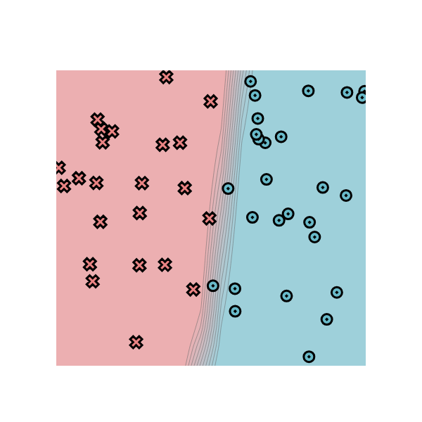

[](https://classroom.github.com/a/YFgwt0yY)
# MiniTorch Module 2


* Docs: https://minitorch.github.io/

* Overview: https://minitorch.github.io/module2/module2/

This assignment requires the following files from the previous assignments. You can get these by running

```bash
python sync_previous_module.py previous-module-dir current-module-dir
```

The files that will be synced are:

        minitorch/operators.py minitorch/module.py minitorch/autodiff.py minitorch/scalar.py minitorch/scalar_functions.py minitorch/module.py project/run_manual.py project/run_scalar.py project/datasets.py


## Module 2.5

Learning Rate: 0.1

Number of Epochs: 500

Time per Epoch: 0.186s

Total Time: 93 seconds




| Epoch |  Loss   | Correct |
|-------|---------|---------|
| 500   | 1.9765  | 50      |
| 490   | 2.0127  | 50      |
| 480   | 2.0503  | 50      |
| 470   | 2.0896  | 50      |
| 460   | 2.1306  | 50      |
| 450   | 2.1735  | 50      |
| 440   | 2.2183  | 50      |
| 430   | 2.2654  | 50      |
| 420   | 2.3147  | 50      |
| 410   | 2.3666  | 50      |
| 400   | 2.4212  | 50      |
| 390   | 2.4787  | 50      |
| 380   | 2.5394  | 50      |
| 370   | 2.6036  | 50      |
| 360   | 2.6717  | 50      |
| 350   | 2.7442  | 50      |
| 340   | 2.8216  | 50      |
| 330   | 2.9043  | 50      |
| 320   | 2.9931  | 50      |
| 310   | 3.0885  | 50      |
| 300   | 3.1911  | 50      |
| 290   | 3.3022  | 50      |
| 280   | 3.4226  | 50      |
| 270   | 3.5538  | 50      |
| 260   | 3.6980  | 50      |
| 250   | 3.8574  | 49      |
| 240   | 4.0350  | 49      |
| 230   | 4.2333  | 49      |
| 220   | 4.4564  | 49      |
| 210   | 4.7095  | 49      |
| 200   | 5.0001  | 49      |
| 190   | 5.3367  | 49      |
| 180   | 5.7304  | 49      |
| 170   | 6.1990  | 49      |
| 160   | 6.7645  | 48      |
| 150   | 7.4502  | 48      |
| 140   | 8.3125  | 48      |
| 130   | 9.3211  | 48      |
| 120   | 10.5069 | 48      |
| 110   | 11.9757 | 48      |
| 100   | 13.8132 | 47      |
| 90    | 15.8962 | 46      |
| 80    | 18.2282 | 46      |
| 70    | 20.7594 | 44      |
| 60    | 23.2151 | 43      |
| 50    | 25.6171 | 42      |
| 40    | 27.7519 | 40      |
| 30    | 29.3709 | 36      |
| 20    | 30.7235 | 34      |
| 10    | 32.3415 | 28      |
